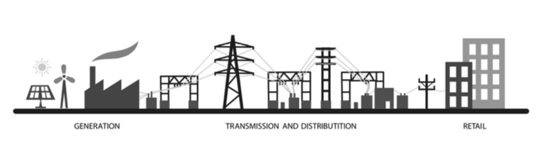

##  **Reproducibility materials**

Description: For the paper "Regularization Approach for Network Modeling of German Energy Market"

__This repository includes:__
- R codes for producing the figures and tables
- R codes for the estimation, model selection etc.

__Description:__
- ribbon3dplot.R: produce 3D ribbon plot in Figure 4.1(a)
- contouplot.R: produce the contour plot shown in Figure 4.1(b)
- imputdata.R: produce the pattern of imputed data in Figure 4.2
- estimation.R: produce the sparse estimation results of (I)SIS-VAR and (I)SIS-SCAD with different lags.
- network.R: produce the full sample connestedness estimates based the selected model.
- network_tabplot.R: produce Table 4.5-4.7 and Figure 4.6 - 4.8.
- qgraph_plot.R: network visulization, produce Figure 4.5.
- **.RData: The estimation results produced by estimation.R.
